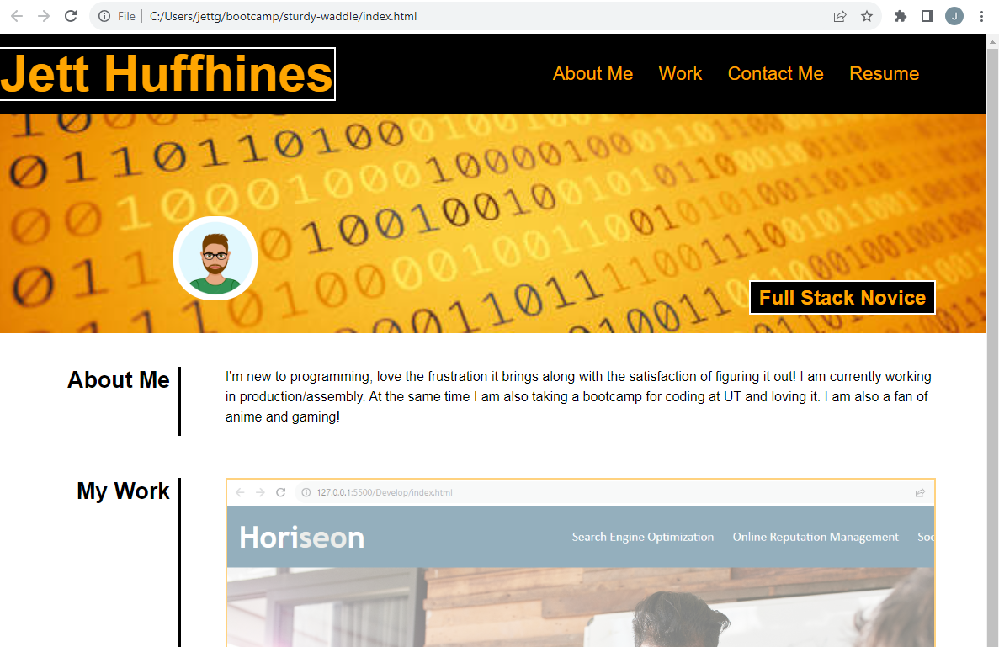
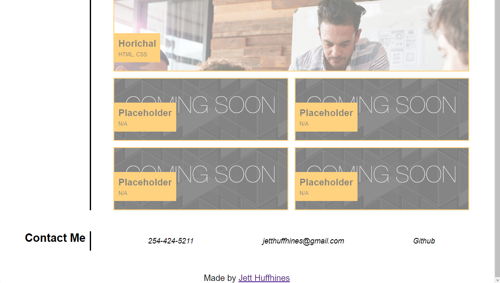

# sturdy-waddle

## Description
To provide a portfolio to share with potential employers. This is to show my 
projects and in turn provide an employer an At-A-Glance coding languages i am skilled with. This portfolio also provides users with multiple forms of contact so that there are many ways to reach me.

## languages used
* CSS
* HTML

## Screenshots 

## Website
https://jettshub.github.io/sturdy-waddle/

## Contributors
* Jett Huffhines 
  *  Github: Jettshub
